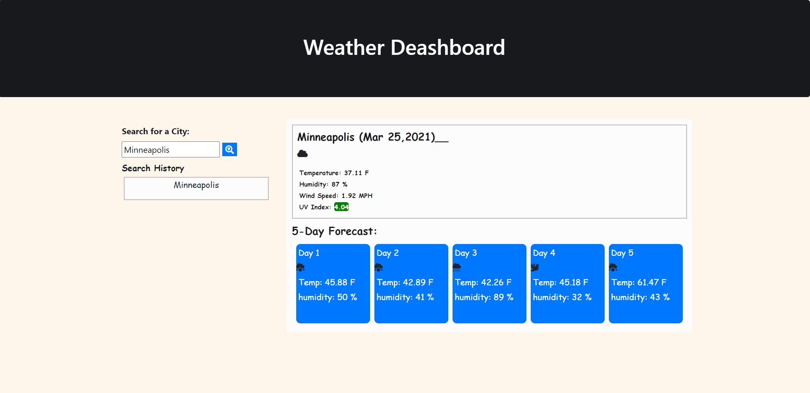

# 06 Server-Side APIs: Weather Dashboard

## My Task

Utilize Third-party APIs to access their data and functionality by making requests with specific parameters to a URL to build a weather dashboard. The weather dashboard will run in the browser and feature dynamically updated HTML and CSS.

Use the [OpenWeather API](https://openweathermap.org/api) to retrieve weather data for cities. The documentation includes a section called "How to start" that provides basic setup and usage instructions. You will use `localStorage` to store any persistent data.


## Acceptance Criteria

```
GIVEN a weather dashboard with form inputs

WHEN I search for a city
THEN I am presented with current and future conditions for that city and that city is added to the search history 

WHEN I view current weather conditions for that city
THEN I am presented with the city name, the date, an icon representation of weather conditions, the temperature, the humidity, the wind speed, and the UV index 

WHEN I view the UV index
THEN I am presented with a color that indicates whether the conditions are favorable, moderate, or severe 

WHEN I view future weather conditions for that city
THEN I am presented with a 5-day forecast that displays the date, an icon representation of weather conditions, the temperature, and the humidity 

WHEN I click on a city in the search history
THEN I am again presented with current and future conditions for that city

```

## References 

All notes provided by © 2021 Trilogy Education Services, LLC, a 2U, Inc. brand. Confidential and Proprietary. All Rights Reserved.

* The URL of the functional, deployed application.
  https://jasonrosasramirez.github.io/06-TravelingWeather/

* The URL of the GitHub repository. Give the repository a unique name and include a readme describing the project.
  https://github.com/Jasonrosasramirez/06-TravelingWeather




list of weather conditions from open weather API 

clear sky
few clouds
scattered clouds
broken clouds
shower rain
rain
thunderstorm
snow
mist